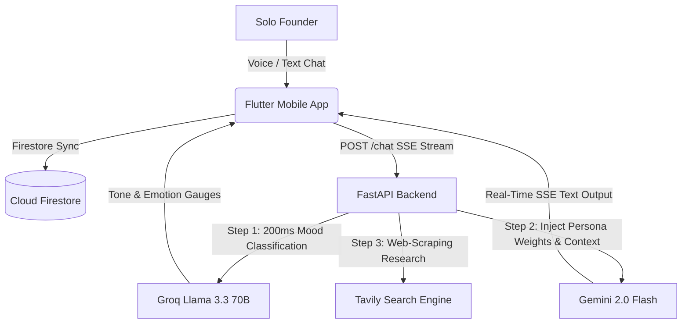

# 🤝 Socio — Your AI Co-Founder

> **"Every founder deserves a co-founder. Now they have one."**

Socio is a high-fidelity mobile application (iOS + Android) that acts as a persistent, proactive **AI co-founder** for solo founders. Rather than a clinical productivity utility, Socio is designed as an emotionally intelligent thinking partner that lives in your pocket. 

At its core is the **Adaptive Persona Engine**: a dynamic system that analyzes the founder's emotional tone and intent in real-time, automatically blending three primary advisory personas:
*   **The Skeptic:** Plays devil's advocate, challenges assumptions, and points out critical risks.
*   **The Hustler:** Focuses on immediate growth, sales, urgency, and speed to market.
*   **The Strategist:** Explains the big picture, long-term roadmaps, competitive moats, and unit economics.

---

## 🎨 System Overview



---

## ⚡ Core Features

### 🧠 Adaptive Persona Chat
A seamless, real-time streaming conversation experience with a live persona gauge indicator. Integrated with native **Text-to-Speech (TTS)** and **Speech-to-Text (STT)** to allow a fully vocal hands-free advisory experience during commutes.

### 🎯 B2B Lead Auto-Discovery (`/find-leads`)
Offloads background queries to Tavily based on target specifications. Employs Gemini to automatically extract, filter, and score prioritised target company leads with budget triggers, fit reasons, and dynamic priority scores.

### 💼 Cold Outreach Suite (`/generate-outreach-email`)
Enables research-backed target profiling to instantly write hyper-personalised cold emails, spoken cold call scripts, and a multi-stage follow-up sequence.

### 📊 Active Investor Pipeline Kanban
A drag-and-drop pipeline interface with warmth ratings, automatic email drafts, and **Real-Time Investor Enrichment (`/enrich-investor`)** that queries search engines for news and announcements to generate suggested hooks and next steps.

### 📡 Live Competitor Radar (`/competitor-radar`)
Automatically scans the market landscape based on startup descriptions, plotting competitor funding, threat levels, and key differentiators.

### ⏰ Proactive Daily Standups
A local scheduled push notification system checking in at **9 AM** (daily priorities setup) and **9 PM** (blockers reflection), mimicking a real check-in partner.

---

## 🛠️ Technology Stack

### Frontend (Flutter Mobile App)
*   **State Management:** Riverpod `^2.5.1` (reactive state-notifiers)
*   **Storage & Database:** Cloud Firestore (offline-first sync), Hive Local Cache
*   **HTTP Client:** Dio `^5.7.0` (with unified centralized configuration)
*   **Voice I/O:** `speech_to_text`, `flutter_tts`
*   **Push Notifications:** `flutter_local_notifications`

### Backend (FastAPI Python Service)
*   **Framework:** FastAPI + Uvicorn Async Server
*   **Primary LLM:** Google Gemini 2.0 Flash (SSE streaming, 1M token context)
*   **Speed Fallback:** Groq Llama 3.3 70B (under 200ms latency)
*   **Search Engine:** Tavily Search API
*   **Testing Suite:** Pytest + TestClient (100% offline hermetic validation)

---

## 🚀 Getting Started

### 1. Backend Setup

1.  Navigate into the backend folder:
    ```bash
    cd socio_backend
    ```
2.  Install dependencies:
    ```bash
    pip install -r requirements.txt
    ```
3.  Configure your environment in a `.env` file:
    ```env
    GEMINI_API_KEY=your-gemini-key
    GROQ_API_KEY=your-groq-key
    TAVILY_API_KEY=your-tavily-key
    ```
4.  Run the backend server locally:
    ```bash
    py -m uvicorn main:app --reload --port 8000
    ```

---

### 2. Running Automated Tests

We employ a comprehensive, high-speed **pytest** suite. By configuring `MOCK_MODE=True`, all tests execute completely **offline and cost-free**, bypassing external API calls with deterministic mock generators:

```bash
cd socio_backend
py -m pytest tests/test_endpoints_pytest.py -v
```

---

### 3. Flutter App Setup

1.  Navigate into the app folder:
    ```bash
    cd socio_app
    ```
2.  Get Flutter dependencies:
    ```bash
    flutter pub get
    ```
3.  **Bridge physical Android devices** to local server (required for physical phone debugging):
    ```bash
    adb reverse tcp:8000 tcp:8000
    # or via explicit SDK path:
    & "$env:LOCALAPPDATA\Android\Sdk\platform-tools\adb.exe" reverse tcp:8000 tcp:8000
    ```
4.  Compile and launch the app:
    ```bash
    flutter run
    ```

---

## 🛡️ License

Built by Team **Doppelganger** for the **QuantCraft 2026 Hackathon** (Galgotias University). Licensed under the MIT License.
